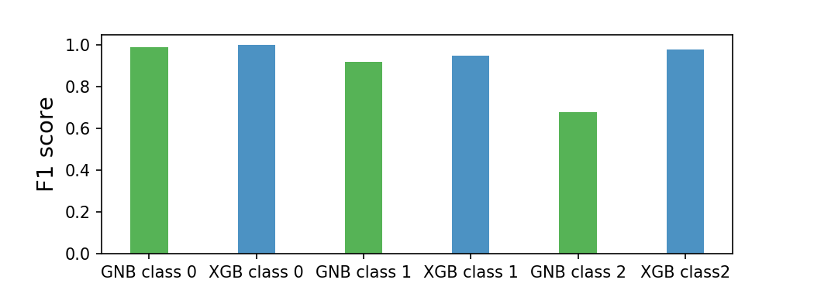

# Hypothyroid Prediction
  
Hypothyroid diseases (underactive thyroid) is a condition in which the body doesn't produce enough of important thyroid 
hormones. The condition may lead to various symptoms at late ages.  More information about the disease is available at 
https://www.mayoclinic.org/diseases-conditions/hypothyroidism/symptoms-causes/syc-20350284 . 

## The Data  

The data was from:  http://archive.ics.uci.edu/ml/datasets/thyroid+disease. I used "allhypo.data" for the analysis. 
"allhypo.names" contains the column names of the data. Include the info about primary data processing in the Jupyter notebook list below. 
* Data processing File: Hypothyroid_Get_Data.ipynb

The data contains several categorical data and several thyroid 
hormone measurements. Several thyroid hormone (T3, TT4, FTI) levels are reduced in disease samples. 

There are 4 class samples in the data set as 'negative'(class 0), 'primary hypothyroid'(class 1), 'compensated hypothyroid' 
(class 2) and 'secondary hypothyroid' (class 3). There are only two instances of class 3. The porject was mainly focus on class 0, class 1 and 2 classification.  

## The model performance 
I have tested several models. Only listed (1) Gaussian Naive Bayes (GaussianNB) and (2) XGBoost method here. 
* (1) XGBoost(XGB) and GaussianNB (GNB) both performed extremely well on class 0 (no disease) with F1 score 1.00 (XGBoost) vs 0.99 (GaussianNB).
* (2) XGB perfomed slightly better than GNB on class 1 (primary hypothyroid) with F1 score 0.95 (XGB) vs 0.92 (GNB).
* (3) XGB) was signicantly better than GNB on class 2 (compensated hypothyroid) with F1 score 0.92 (XGB) vs 0.68 (GNB). 

The Goal is to make a web application that performs reasonally fast. XGBoost doesn't require too much computation power and should be good choice for the app on both the performance and speed.   

### Feature importance

### Things to do for an app
* write a function that uses params obtained from processing training data, to process test data in exactly the same way.  
* export onehotencoding params that be reconstructed to onehot_encode the test data in the same manner. 
* use flaskapp to build web app. 
